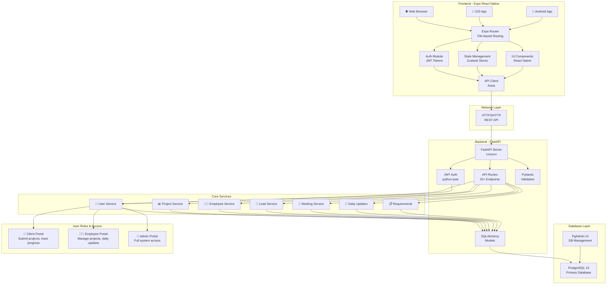
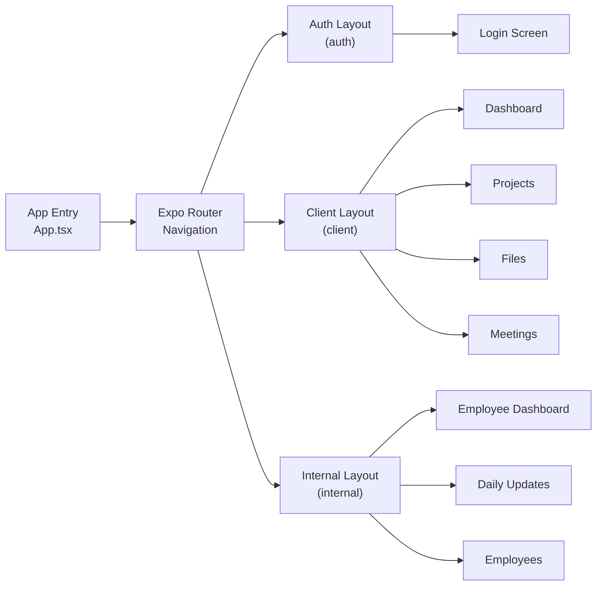
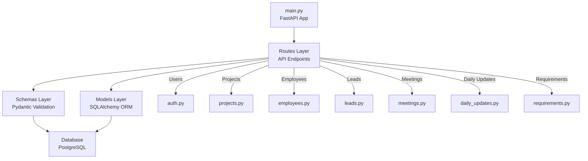
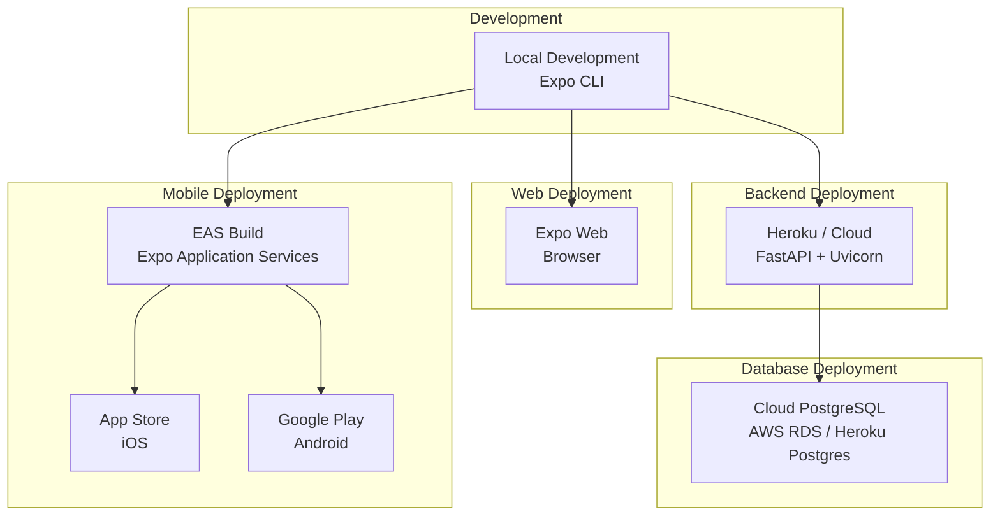

# 3J Technologies - Architecture Diagram

## System Architecture



---

## Architecture Overview

| Layer | Components | Tech Stack |
|-------|-----------|-----------|
| **Frontend** | 3 platforms (Web, iOS, Android) with shared codebase | Expo, React Native, TypeScript |
| **Routing & State** | File-based routing, JWT auth, Zustand stores | Expo Router, Zustand |
| **API Communication** | REST endpoints via HTTP/HTTPS | Axios, JSON |
| **Backend Server** | FastAPI with Uvicorn ASGI server | FastAPI, Python 3.10+ |
| **Business Logic** | 7 core services (Users, Projects, Employees, etc.) | Python, Pydantic |
| **Data Persistence** | SQLAlchemy ORM with PostgreSQL | PostgreSQL 15, SQLAlchemy 2.0 |
| **Admin Tools** | PgAdmin for database management | PgAdmin UI |

---

## Data Flow

1. **User Authentication**
   - User logs in with email/password
   - Backend validates credentials and generates JWT token
   - Token stored securely in AsyncStorage (encrypted on device)

2. **API Communication**
   - Token included in all subsequent API requests
   - Backend verifies token signature on each request
   - Expired token triggers automatic logout

3. **Request Processing**
   - API routes receive request
   - Pydantic validates input data
   - JWT auth verifies user permissions
   - SQLAlchemy models handle database operations

4. **Response & State Update**
   - Backend processes request and returns JSON response
   - Zustand stores update application state
   - UI components re-render with new data

---

## Frontend Architecture



---

## Backend Architecture



---

## Core Services

### 1. **User Service** 👤
- Registration & Login
- JWT Token Management
- Role-Based Access Control (Admin, Employee, Client)
- User Profile Management

### 2. **Project Service** 📊
- Create & Manage Projects
- Project Status Tracking (planning, in_progress, on_hold, completed)
- Associate Requirements
- Track Project Members

### 3. **Employee Service** 👨‍💼
- Employee Profile Management
- Department & Designation Tracking
- Assign to Projects
- Performance Tracking

### 4. **Lead Service** 💼
- Sales Lead Management
- Lead Status Pipeline (new, contacted, qualified, proposal_sent, negotiation, won, lost)
- Contact Information Management
- Lead Notes & History

### 5. **Meeting Service** 📅
- Schedule Meetings
- Manage Attendees
- Link to Projects
- Track Meeting Details

### 6. **Daily Updates Service** 📝
- Submit Daily Progress Updates
- Track Employee Activities
- Date-Based Organization
- Update History

### 7. **Requirements Service** 📋
- Create Project Requirements
- Status Tracking
- Link to Projects
- Requirement History

---

## Security Architecture

```
┌─────────────────────────────────────────┐
│         Frontend (Client Side)          │
│                                         │
│  • AsyncStorage (Encrypted Tokens)     │
│  • JWT Authentication                  │
│  • Secure API Calls                    │
└────────────────┬────────────────────────┘
                 │
                 │ HTTPS/SSL
                 ▼
┌─────────────────────────────────────────┐
│      Backend (Server Side)              │
│                                         │
│  • JWT Token Verification              │
│  • Bcrypt Password Hashing             │
│  • Role-Based Access Control           │
│  • Input Validation (Pydantic)         │
│  • CORS Protection                     │
└────────────────┬────────────────────────┘
                 │
                 │ SQL Queries
                 ▼
┌─────────────────────────────────────────┐
│      Database (PostgreSQL)              │
│                                         │
│  • Encrypted Passwords                 │
│  • Role-Based Permissions              │
│  • Data Integrity Constraints          │
└─────────────────────────────────────────┘
```

---

## Deployment Architecture



---

## Technology Stack Summary

### Frontend Stack
- **Framework**: Expo 56.0.8
- **Language**: TypeScript 6.0.3
- **UI Library**: React Native 0.85.3
- **Routing**: Expo Router (file-based, like Next.js)
- **State Management**: Zustand
- **HTTP Client**: Axios
- **Form Management**: React Hook Form
- **Platforms**: iOS, Android, Web

### Backend Stack
- **Framework**: FastAPI 0.136.3
- **Server**: Uvicorn 0.48.0
- **Language**: Python 3.10+
- **ORM**: SQLAlchemy 2.0.50
- **Data Validation**: Pydantic 2.13.4
- **Authentication**: python-jose (JWT)
- **Password Hashing**: Bcrypt

### Infrastructure Stack
- **Database**: PostgreSQL 15
- **Container**: Docker & Docker Compose
- **Admin UI**: PgAdmin
- **Build/Deploy**: EAS (Expo Application Services)
- **Version Control**: Git

---

## Project Statistics

| Metric | Value |
|--------|-------|
| **Frontend Code** | 3000+ lines (TypeScript/React Native) |
| **Backend Code** | 1500+ lines (Python/FastAPI) |
| **Database Models** | 7 core models |
| **API Endpoints** | 20+ RESTful endpoints |
| **UI Components** | 15+ reusable components |
| **Supported Platforms** | iOS, Android, Web |
| **Authentication Type** | JWT-based with role access control |
| **User Roles** | 3 distinct roles (Admin, Employee, Client) |

---

## File Structure Overview

```
3j/
├── 📁 backend/
│   ├── 📁 app/
│   │   ├── 📁 database/        # Database connection config
│   │   ├── 📁 models/          # SQLAlchemy ORM models
│   │   ├── 📁 routes/          # API endpoint definitions
│   │   └── 📁 schemas/         # Pydantic validation schemas
│   ├── 📄 main.py              # FastAPI application entry
│   ├── 📄 init_db.py           # Database initialization
│   └── 📄 requirements.txt     # Python dependencies
│
├── 📁 src/
│   ├── 📁 api/                 # HTTP service clients
│   ├── 📁 store/               # Zustand state stores
│   ├── 📁 components/          # Reusable UI components
│   ├── 📁 theme/               # Design tokens & styling
│   └── 📁 types/               # TypeScript type definitions
│
├── 📁 app/                      # Expo Router screens
│   ├── 📁 (auth)/              # Authentication screens
│   ├── 📁 (client)/            # Client portal screens
│   └── 📁 (internal)/          # Employee/Admin portal
│
├── 📄 package.json             # Node.js dependencies
├── 📄 app.json                 # Expo configuration
├── 📄 eas.json                 # EAS build config
├── 📄 tsconfig.json            # TypeScript config
└── 🐳 docker-compose.yml       # Docker services
```

---

**Made with ❤️ for 3J Technologies**
**Last Updated: June 2026**
